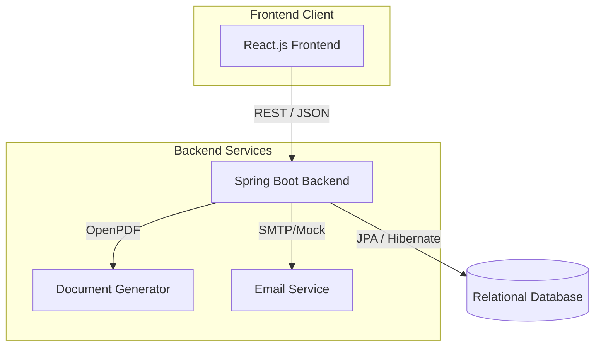
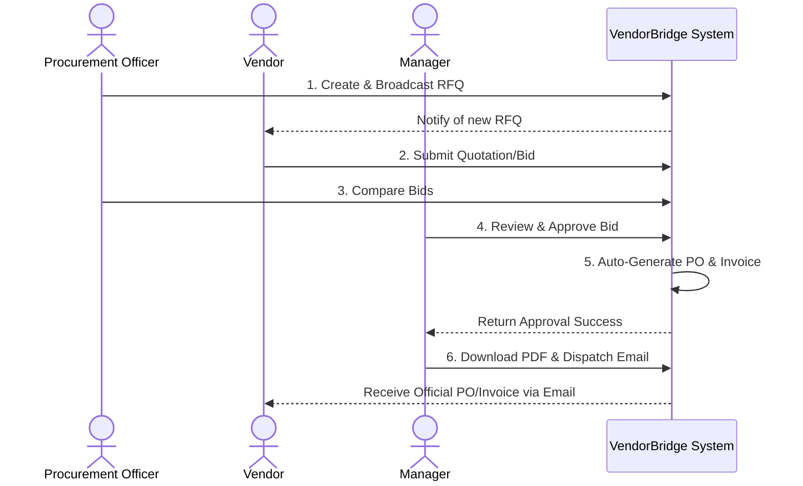

# VendorBridge 🌉

VendorBridge is an automated procurement and vendor management platform built for speed, transparency, and enterprise compliance. It bridges the gap between procurement officers, vendors, and management approvers through a seamless, automated workflow.

## 🚀 Key Features

1. **Role-Based Workspaces**: Specialized dashboards for Procurement Officers, Vendors, Managers/Approvers, and System Admins.
2. **Automated Procurement Workflow**: 
   - Broadcast Requests for Quotations (RFQs).
   - Vendors submit secure, standardized bidding quotes.
   - Side-by-side bid comparison.
3. **One-Click Approvals**: Managers can review bids and execute approvals in a single click.
4. **Document Automation**: Automatic generation of Purchase Orders (POs) and Invoices upon approval.
5. **Dynamic PDF Generation**: On-the-fly PDF rendering for Invoices using OpenPDF.
6. **Notification System**: Built-in automated email notification hooks for dispatching legal documents.

---

## 🛠️ Tech Stack

- **Frontend**: React.js, Vite, Vanilla CSS (Glassmorphism & Dark Mode UI).
- **Backend**: Java 21, Spring Boot 3, Spring Security (JWT Auth).
- **Database**: PostgreSQL (or H2 for local testing), Flyway for Migrations.
- **Document Generation**: OpenPDF.
- **CI/CD**: GitHub Actions (Strict Checkstyle validation).

---

## 🏗️ System Architecture



## 🔄 Procurement Workflow



---

## 🚀 Running Locally

### Prerequisites
- Node.js (v18+)
- Java JDK 21
- Maven

### 1. Start the Backend

```bash
cd backend
./mvnw clean install -DskipTests
./mvnw spring-boot:run
```
The backend runs on `http://localhost:8081`.

### 2. Start the Frontend

```bash
cd frontend
npm install
npm run dev
```
The frontend runs on `http://localhost:5173`.

---

## 🧪 Testing & Validation Plan

If you are judging or testing this project, please follow this flow to verify the features:

### 1. Authentication & Roles
- **Register:** Create two accounts (e.g., one Officer, one Manager).
- **Login:** Verify successful authentication and JWT delivery.
- **Roles:** Verify that different roles see different console navigation options.

### 2. Core Workflow
- **RFQ Creation:** Log in as an Officer, create a new RFQ. Verify it appears in the active list.
- **Quotation Submission:** Log in as a Vendor, submit a price bid for the RFQ.
- **Comparison:** Log in as an Officer, view the submitted bids.
- **Approval:** Log in as a Manager, go to Approvals, and click "Approve & Disburse PO".

### 3. Automation Verification
- **POs & Invoices:** Verify that upon approval, a new Purchase Order and Invoice were dynamically created in the database and visible in the UI.
- **PDF Generation:** Click "Download PDF" on the newly generated document and verify the layout and dynamic data insertion.
- **Mock Emails:** Click "Send Email" and check the Spring Boot console logs to verify the dispatch hook was executed successfully.

---
*Built with ❤️ for the Hackathon.*
